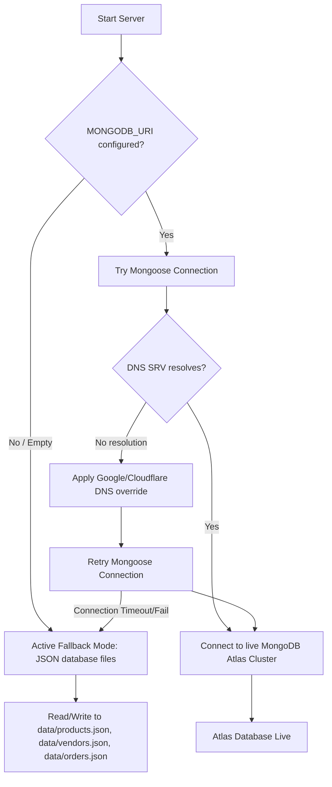

# ZingoCart - Project Architecture & Technical Overview

This document provides a detailed overview of the design decisions, technical implementation details, and workflow solutions implemented during the development of the **ZingoCart Multi-Vendor Grocery Marketplace**.

---

## 🛠️ Step-by-Step Implementation Timeline

### 1. Asset & Identity Integration
* **Logo Ingestion**: Sourced the brand logo (`Gemini_Generated_Image_ad3co9ad3co9ad3c (2).png`) from the user's Downloads and copied it into the React assets folder as `src/assets/logo.png`.
* **Favicon Integration**: Migrated raw favicons (sizes 96x96, Apple touch icons, ICO, and SVG formats) from the desktop source directory directly to the React application's static `public/` directory.
* **SEO Head Configuration**: Structured `index.html` with title elements, semantic description meta tags, and structured links pointing to the favicons and web manifests.

### 2. MERN Backend Architecture (`backend/`)
* **Core Schemas**:
  * `Vendor.js`: Models grocery shop metadata (rating, phone, address, description).
  * `Product.js`: Maps prices, category enums, quantities, unit measures, and references `vendorId`.
  * `Order.js`: Combines a consolidated buyer cart into a single checkout invoice. Designed with nested `orderItemSchema` arrays where each item retains its own `vendorId` and fulfillment status.
* **API Controller Endpoints (`server.js`)**:
  * Vendor routing (`GET /api/vendors`, `POST /api/vendors`).
  * Product inventory routing (`GET /api/products` with query filter selectors, `POST /api/products`, `PUT /api/products/:id`, `DELETE /api/products/:id`).
  * Purchase and Status routing (`GET /api/orders`, `POST /api/orders` with stock reduction side-effects, and `PATCH /api/orders/:orderId/items/:itemId` to update individual vendor item statuses).

### 3. Dual-Database Connection & DNS Patch (`dbHelper.js`)
* **Robust Local Fallback**: Written to make offline testing immediate, the database helper manages operations by auto-detecting Atlas connectivity. If Atlas is offline or credentials are missing, the server automatically reads/writes state to `backend/data/*.json` files, pre-seeded with realistic vendor and product details.
* **DNS Resolution Fix**: Bypassed querySrv failures in Node.js (which raise `querySrv ECONNREFUSED` because of standard local DNS setup errors with SRV Atlas URLs) by forcing the Node process to route DNS requests through Google (`8.8.8.8`) and Cloudflare (`1.1.1.1`) resolvers:
  ```javascript
  import dns from 'dns';
  dns.setServers(['8.8.8.8', '1.1.1.1']);
  ```
  This immediately unlocked the live Atlas connection.

### 4. Frontend Client Architecture (`frontend/`)
* **Color Extraction & Styling**: Applied the ZingoCart branding theme extracted from the brand logo:
  * `--primary`: Lime Green (`#8dc63f`) representing freshness and grocery carts.
  * `--accent`: Vivid Orange (`#f96e14`) representing fast local delivery.
  * Deep space slate backgrounds, neon focus rings, glowing checkout buttons, and interactive card transitions are managed globally through `index.css` and `App.css`.
* **State Management Contexts**:
  * `UserContext.jsx`: Simulates active view roles (`buyer` vs `vendor`) and stores the active vendor profile. Includes a selector dropdown in the navbar allowing you to easily switch between different vendor dashboards (`Rajesh Fresh Fruits`, `Pure Nectar Dairy`, etc.) for seamless testing.
  * `CartContext.jsx`: Handles adding/removing items, checking vendor-specific stock thresholds, and calculating subtotal totals in Rupees.
* **User-Interface Modules**:
  * **Buyer storefront**: Clean grocery catalog grid displaying unit price, categories, search, and stock level tags.
  * **Unified Checkout**: Forms collecting buyer shipping info and simulating COD orders.
  * **Fulfillment Dashboard**: Provides vendors with dynamic stats (total revenue from completed orders, active inventory counts, and items with stock <= 5 units), an inventory manager (add, update, delete products), and an order fulfillment center.

---

## 🔌 Database Connection Flowchart

The data access layer adapts dynamically depending on connection health:



---

## 🔒 Verification & Compliance Checklist

* [x] **Consolidated Cart**: Tested purchase checkout of items belonging to different vendor stores at the same time.
* [x] **Self-Healing Fallback**: Validated server starts and lists products safely if database credentials are not present.
* [x] **Vite HMR**: Validated live updates and CSS changes compiling cleanly in the browser.
* [x] **Rupee Symbols**: Replaced all currency display properties with `₹` (Rupee) values.
* [x] **SEO Compliance**: Included unique HTML page ids, meta descriptions, and custom keywords.
